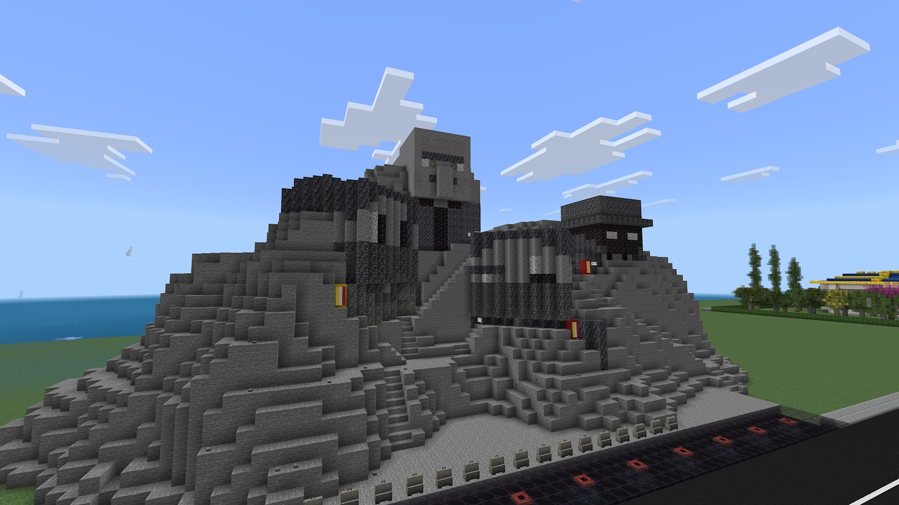

# 👥 Nations membres de l'O.B.I.

Retrouvez ici les détails, l'histoire et les monuments de chaque nation de l'alliance.

---

## Prismara

**Description :** Prismara est un royaume composé de 3 rois représentants 3 peuples différents.

* **Capitale :** Soliris
* **Chef d'État :** Natpro; KingShikani; KrackTheDarck
* **Monument emblématique :** Mont-Royal

#### 📸 Aperçu de la nation

---

## A Altaiea

**Description :** Aucune

* **Capitale :** ??
* **Chef d'État :** ??
* **Monument emblématique :** ??

#### 📸 Aperçu de la nation

---
_Pour ajouter votre nation ou modifier une description, contactez l'administrateur._